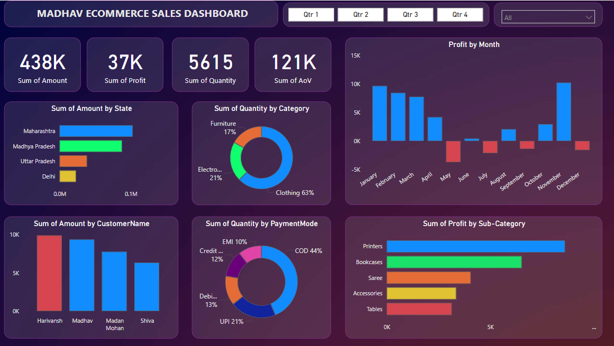

# E-Commerce Sales Analysis
Created Interactive dashboard and analysed E-commerce sales data using POWER BI
# Key Visualizations
Analysed and Compared purchasing behaviour of top customers using various visualization tools from high-revenue states, focusing on sales of top-performing items.
# Tools Used
Slicers, Filters, Line Chart, Pie Chart, Donut Chart, Clustered Bar chart, Scatter Chart, Area Chart
# Dashboard Preview

